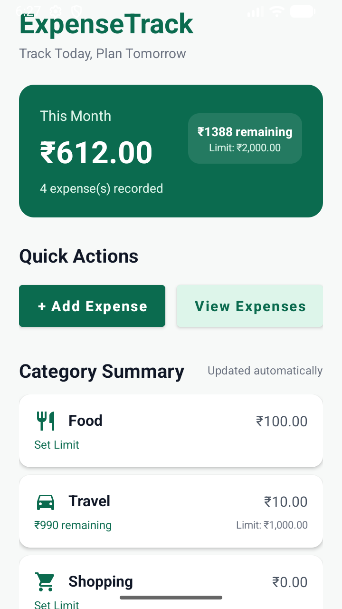
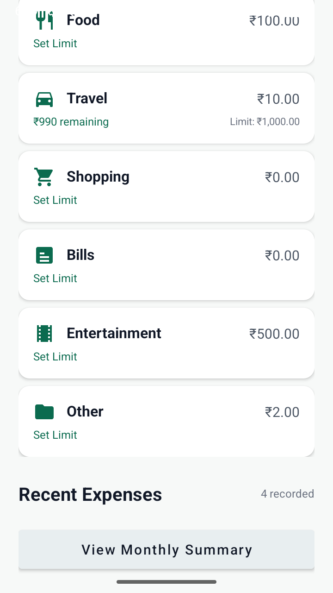
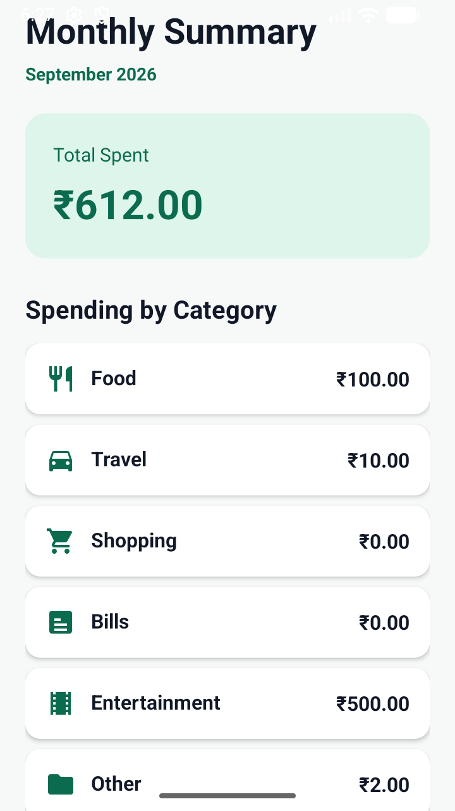

# ExpenseTrack 💰

ExpenseTrack is a modern, lightweight Android application designed to help users manage their daily expenses and track spending limits. Built using Kotlin and Modern Android Development (MAD) practices, it features local persistence, receipt management, and real-time limit alerts.

## 🚀 Features

- **Expense Tracking:** Add, edit, and delete expenses with details like amount, category, date, and notes.
- **Receipt Management:** Capture receipts using the camera or upload from the gallery.
- **Spending Limits:** Set monthly and category-specific spending limits.
- **Smart Notifications:** Receive instant alerts when you exceed your spending limits.
- **Monthly Summary:** View a breakdown of expenses by category to understand your spending habits.
- **Local Persistence:** All data is stored securely on-device using Room Database.

## 🛠️ Technical Stack

- **Language:** [Kotlin](https://kotlinlang.org/)
- **UI:** XML with ViewBinding and Material Design 3 components.
- **Local Database:** [Room](https://developer.android.com/training/data-storage/room) (SQLite abstraction).
- **Concurrency:** [Coroutines](https://kotlinlang.org/docs/coroutines-overview.html) for non-blocking database operations.
- **Architecture:** MVVM-ready structure with repository-style data access.
- **Permissions:** Dynamic handling for Camera and Notification permissions.

### Screenshots
| Dashboard |  |  |
| :---: | :---: | :---: |
|  |  |  |

## 🧠 Core Concepts & Code Logic

### 1. Database Architecture (Room)
The app uses Room to manage a local SQLite database named `expense_database`. 
- **`Expense` Entity:** Represents the table structure.
- **`ExpenseDao`:** Defines the SQL operations (`@Insert`, `@Query`, `@Update`, `@Delete`).
- **`AppDatabase`:** The singleton instance that provides the DAO and handles database migrations.

### 2. Limit Tracking Logic
When a user adds or updates an expense, the app triggers `checkLimitsAndNotify()`. 
```kotlin
private suspend fun checkLimitsAndNotify(category: String, newAmount: Double, excludeId: Int) {
    // 1. Fetch current month's expenses, excluding the one being edited
    // 2. Calculate total spent vs monthly limit
    // 3. Calculate category spent vs category limit
    // 4. Trigger High-Priority Notification if limits are exceeded
}
```

### 3. Receipt Storage
Receipts are handled using `ActivityResultContracts`. The app generates a `Uri` via `MediaStore` for captured photos, ensuring the images are stored in the system's `Pictures/ExpenseTrack` directory and remains accessible via the generated URI in the database.

### 4. Adaptive UI
The dashboard uses `ViewBinding` to update UI components dynamically. It calculates remaining limits in real-time and changes text colors (e.g., to error red) if a user is over budget.

## 🏗️ Getting Started

1. Clone the repository: `git clone https://github.com/yourusername/ExpenseTrack.git`
2. Open the project in **Android Studio Ladybug (or newer)**.
3. Sync Gradle and run the app on an emulator or physical device.

## 📄 License
This project is licensed under the MIT License - see the [LICENSE](LICENSE) file for details.
