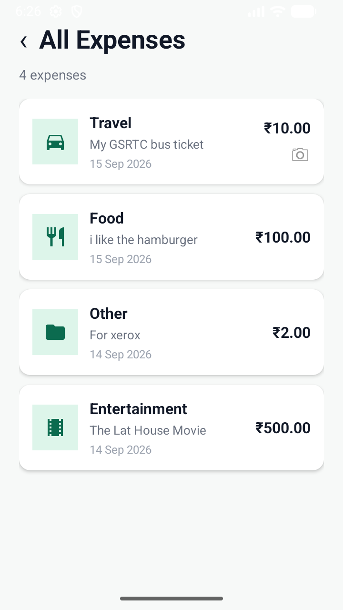
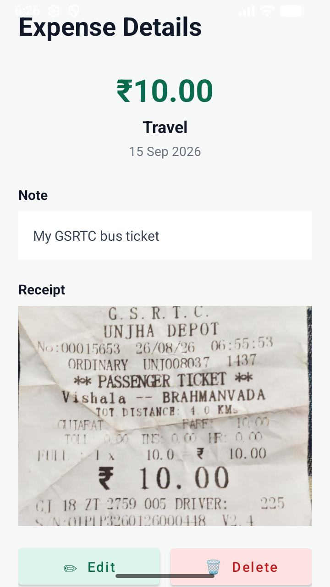
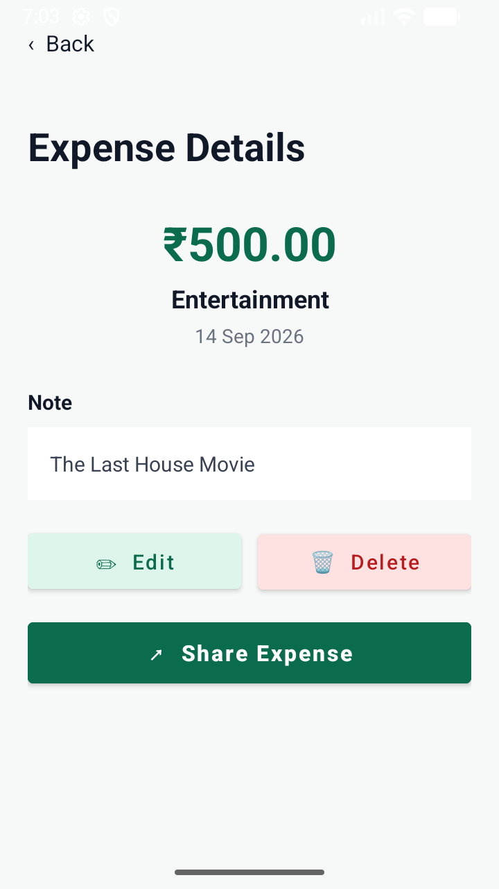
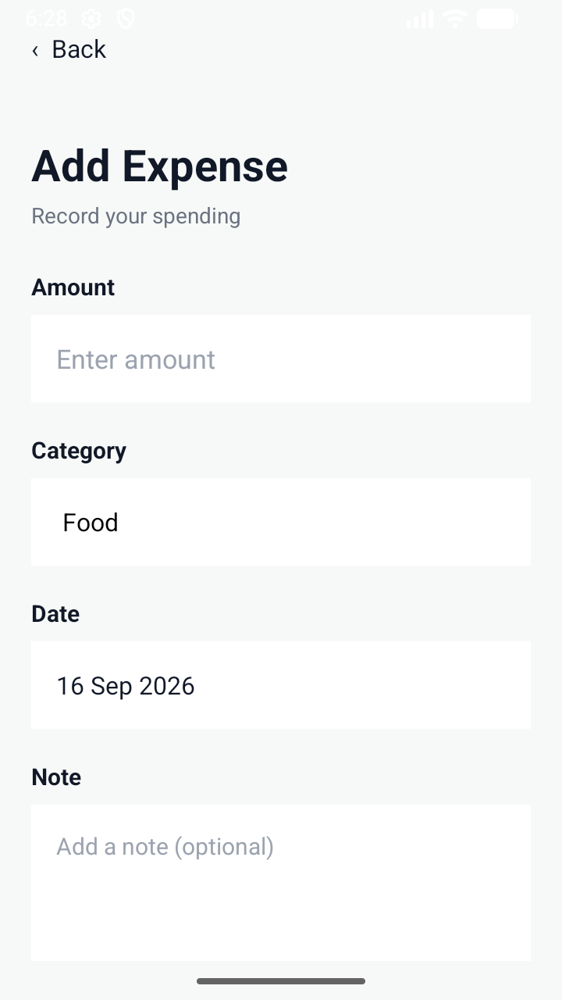
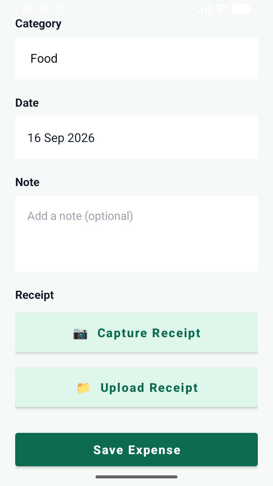
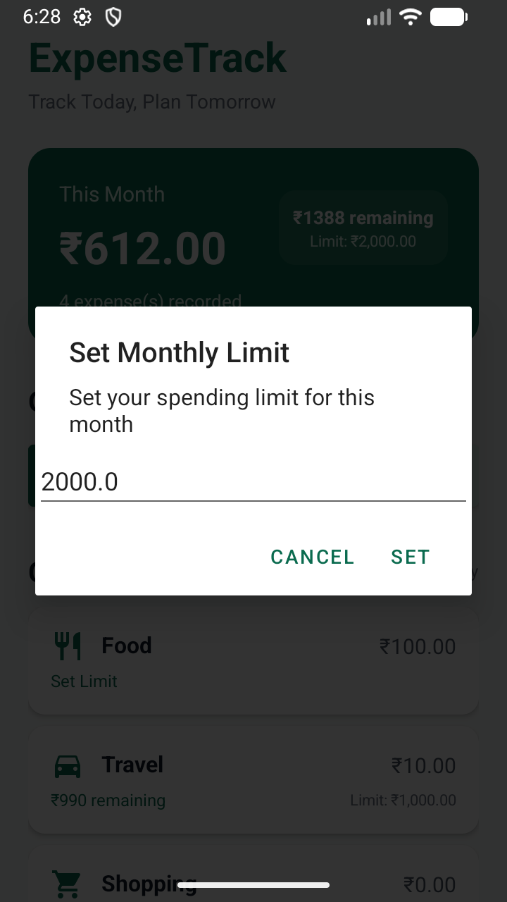

# ExpenseTrack – Personal Expense & Receipt Manager

## 📱 Project Overview

**ExpenseTrack** is a simple Android application for recording and managing personal expenses.

The app allows users to enter their own expense information, organize expenses by category, attach receipt images, set spending limits, view summaries, and share expense information with other apps.

The project is designed as a **Mobile Application Development (MAD) project** and demonstrates how multiple Android concepts can be combined into one practical application.

> **Important:** ExpenseTrack does not add fake or predefined spending data. A new user starts with no expenses, and money values are generated only from expenses entered by the user.

---

## 🎯 Purpose of the Project

The main purpose of ExpenseTrack is to provide a simple digital way to keep track of personal spending.

Instead of trying to remember daily purchases, the user can record:

- Expense amount
- Category
- Date
- Optional note
- Receipt photo

The app then stores the information locally and uses it to calculate spending totals and summaries.

The project also provides a practical way to demonstrate important MAD concepts such as:

- XML UI development
- Kotlin programming
- ViewBinding
- Room Database
- RecyclerView
- CRUD operations
- Camera integration
- Image selection
- SharedPreferences
- Notifications
- Intent-based data sharing

---

## 💡 Why ExpenseTrack?

Expense tracking is a common real-world requirement. This project was selected because it provides a useful scenario in which several Android development concepts can be implemented together.

The objective is not to create a commercial replacement for existing finance applications. The objective is to design and implement a complete Android solution while demonstrating the concepts required for a MAD project.

---

### Screenshots
| Dashboard |  |  |
| :---: | :---: | :---: |
|  |  |  |

|  |  |  |
| :---: | :---: | :---: |
|  |  |  |

|  |  |  |
| :---: | :---: | :---: |
|  |  |  |

## ✨ Main Features

### 🔐 Login

The application includes a simple login screen with:

- Email input
- Password input
- Basic input validation
- Login button

The login screen acts as the entry point to the application.

### 💰 Add Expense

Users can create a new expense by entering:

- Amount
- Category
- Date
- Optional note

The amount field is intentionally **empty for a new expense** so the user enters their own value.

### 📸 Receipt Management

Users can attach purchase proof in two ways:

- **Capture Receipt** – take a new photo using the camera
- **Upload Receipt** – select an existing image

The receipt URI is stored with the corresponding expense record.

### 📋 View Expenses

All saved expenses are displayed using a RecyclerView.

Each expense can show:

- Category
- Note
- Date
- Amount
- Receipt indicator

### ✏️ Edit Expense

Users can open an existing expense and edit its:

- Amount
- Category
- Date
- Note
- Receipt

The existing values are loaded from the database before editing.

### 🗑️ Delete Expense

Users can delete an expense after a confirmation dialog.

### 📊 Monthly Summary

The app calculates the current month's spending and displays category-wise totals for:

- Food
- Travel
- Shopping
- Bills
- Entertainment
- Other

### 🎯 Spending Limits

Users can set:

- Monthly spending limit
- Category-specific spending limits

The dashboard can display the remaining amount and indicate when spending goes over a configured limit.

### 🔔 Notifications

The project includes notification support for spending-limit alerts.

### 📤 Share Expenses

ExpenseTrack can create shareable text for:

- A single expense
- All expenses
- Monthly summaries

It uses Android's sharing mechanism so the user can choose compatible applications such as WhatsApp, Messages, Gmail, or other available apps.

---

# 🏗️ Project Structure

The project follows a simple Activity + Adapter + Database organization.

```text
ExpenseTrack/
│
├── app/
│   │
│   ├── src/main/
│   │   │
│   │   ├── java/com/example/expensetrack/
│   │   │   │
│   │   │   ├── MainActivity.kt
│   │   │   ├── LoginActivity.kt
│   │   │   ├── AddExpenseActivity.kt
│   │   │   ├── ExpenseListActivity.kt
│   │   │   ├── ExpenseDetailActivity.kt
│   │   │   ├── SummaryActivity.kt
│   │   │   ├── Utils.kt
│   │   │   │
│   │   │   ├── adapter/
│   │   │   │   └── ExpenseAdapter.kt
│   │   │   │
│   │   │   └── database/
│   │   │       ├── Expense.kt
│   │   │       ├── ExpenseDao.kt
│   │   │       └── AppDatabase.kt
│   │   │
│   │   ├── res/
│   │   │   │
│   │   │   ├── drawable/
│   │   │   │   ├── bg_limit_chip.xml
│   │   │   │   ├── ic_food.xml
│   │   │   │   ├── ic_travel.xml
│   │   │   │   ├── ic_shopping.xml
│   │   │   │   ├── ic_bills.xml
│   │   │   │   ├── ic_entertainment.xml
│   │   │   │   ├── ic_other.xml
│   │   │   │   └── launcher icons
│   │   │   │
│   │   │   ├── layout/
│   │   │   │   ├── activity_login.xml
│   │   │   │   ├── activity_main.xml
│   │   │   │   ├── activity_add_expense.xml
│   │   │   │   ├── activity_expense_list.xml
│   │   │   │   ├── activity_expense_detail.xml
│   │   │   │   ├── activity_summary.xml
│   │   │   │   └── item_expense.xml
│   │   │   │
│   │   │   ├── values/
│   │   │   │   ├── colors.xml
│   │   │   │   ├── strings.xml
│   │   │   │   └── themes.xml
│   │   │   │
│   │   │   └── ...
│   │   │
│   │   └── AndroidManifest.xml
│   │
│   └── ...
│
└── README.md
```

### File Responsibilities

| File | Purpose |
|---|---|
| `LoginActivity.kt` | Handles login screen input and validation |
| `MainActivity.kt` | Controls dashboard, totals, categories, limits, and navigation |
| `AddExpenseActivity.kt` | Adds or edits an expense and handles receipt selection |
| `ExpenseListActivity.kt` | Loads and displays all expenses |
| `ExpenseDetailActivity.kt` | Shows a single expense and supports edit/delete/share |
| `SummaryActivity.kt` | Calculates and displays monthly/category spending |
| `ExpenseAdapter.kt` | Connects expense data with RecyclerView |
| `Expense.kt` | Room entity representing an expense |
| `ExpenseDao.kt` | Contains Room database operations |
| `AppDatabase.kt` | Creates and manages the Room database |
| `Utils.kt` | Shared utility functions such as currency formatting |
| `activity_*.xml` | Screen layouts |
| `item_expense.xml` | Layout for one RecyclerView expense item |
| `drawable/*` | Icons and UI drawable resources |
| `AndroidManifest.xml` | Registers application components and required permissions |

---

# 🔄 How the Application Works

## 1. Login Flow

```text
Login Screen
     ↓
Enter Email + Password
     ↓
Validation
     ↓
Main Dashboard
```

---

## 2. Add Expense Flow

```text
Home
  ↓
Add Expense
  ↓
Enter Amount
  ↓
Select Category
  ↓
Select Date
  ↓
Add Note
  ↓
Capture or Upload Receipt
  ↓
Save Expense
  ↓
Room Database
```

---

## 3. CRUD Flow

```text
CREATE
User enters expense
        ↓
ExpenseDao.insertExpense()
        ↓
Room Database
```

```text
READ
Room Database
        ↓
ExpenseDao.getAllExpenses()
        ↓
ExpenseAdapter
        ↓
RecyclerView
```

```text
UPDATE
Open Expense
        ↓
Edit Expense
        ↓
ExpenseDao.updateExpense()
        ↓
Room Database
```

```text
DELETE
Open Expense
        ↓
Delete
        ↓
Confirmation
        ↓
ExpenseDao.deleteExpense()
        ↓
Room Database
```

---

## 4. Receipt Flow

```text
Capture Receipt
      ↓
Camera Permission
      ↓
Camera
      ↓
Take Photo
      ↓
Receipt URI
      ↓
Display Image
      ↓
Store URI with Expense
```

or:

```text
Upload Receipt
      ↓
Image Picker
      ↓
Select Image
      ↓
Receipt URI
      ↓
Display Image
      ↓
Store URI with Expense
```

---

## 5. Monthly Summary Flow

```text
Room Database
      ↓
Read Expenses
      ↓
Filter Current Month
      ↓
Calculate Total
      ↓
Calculate Category Totals
      ↓
Display Summary
```

---

## 6. Sharing Flow

```text
Expense / Summary
       ↓
Generate Text
       ↓
Intent.ACTION_SEND
       ↓
Android Share Chooser
       ↓
WhatsApp / Messages / Gmail / Other Apps
```

---

# 🗄️ Database Design

ExpenseTrack uses a Room database with an `expenses` table.

### Expense Entity

```text
Expense
│
├── id
├── amount
├── category
├── date
├── note
└── receiptUri
```

### CRUD Mapping

| Operation | Room Method | Application Use |
|---|---|---|
| Create | `insertExpense()` | Save expense |
| Read | `getAllExpenses()` | Show expense list |
| Read | `getExpenseById()` | Show expense details |
| Update | `updateExpense()` | Edit expense |
| Delete | `deleteExpense()` | Remove expense |

---

# 🧩 Important MAD Concepts

## Kotlin

Kotlin is used for all application logic and Android Activities.

## XML

XML is used to create the application screens and UI components.

## ViewBinding

ViewBinding connects Kotlin code with XML views in a type-safe way.

Example:

```kotlin
binding.btnAddExpense.setOnClickListener {
    // Open Add Expense screen
}
```

## Room Database

Room provides local persistent storage for expense records.

## RecyclerView

RecyclerView displays the expense list efficiently using an Adapter.

## Activity Result API

The project uses the Activity Result API for camera capture and image selection.

## SharedPreferences

SharedPreferences stores user-defined spending limits.

## AlertDialog

Dialogs are used for actions such as setting limits and confirming deletion.

## Notification

Android notification support is used for spending-limit alerts.

## Intent.ACTION_SEND

The app uses Android's standard sharing mechanism for inter-app communication.

---

# 🎨 UI Design

ExpenseTrack follows a clean and simple finance-app design.

### Design characteristics

- Light background
- Dark green primary color
- Rounded Material cards
- Clear typography
- Large amount display
- Category icons
- Simple buttons
- Consistent spacing
- Empty-state screens

### Primary Color Palette

```text
Primary       #0B6B4F
Light Primary #DDF5EA
Background    #F7F9F8
Text          #111827
Secondary     #6B7280
Error         #B91C1C
```

---

# 💵 Initial Application State

The application starts with an empty expense database.

Expected initial state:

```text
Total Spent       ₹0.00
Food              ₹0.00
Travel            ₹0.00
Shopping          ₹0.00
Bills             ₹0.00
Entertainment     ₹0.00
Other             ₹0.00

Recent Expenses
No expenses yet
```

The **Add Expense amount field is empty**:

```text
Enter amount
```

No expense such as ₹100, ₹500, ₹1,000, etc. is automatically inserted.

---

# 🧪 Testing

The following scenarios should be tested:

### Test 1 – Add Expense

Enter an amount and category, optionally attach a receipt, and save.

### Test 2 – Read Expense

Open All Expenses and verify that the saved record appears.

### Test 3 – Edit Expense

Open a record, modify the amount/details, and confirm the updated record appears throughout the application.

### Test 4 – Delete Expense

Delete a record and confirm that it disappears and totals are recalculated.

### Test 5 – Receipt

Capture or upload a receipt and verify that it is displayed with the expense.

### Test 6 – Summary

Add several expenses in different categories and verify the monthly/category totals.

### Test 7 – Limits

Set a monthly or category limit and verify the remaining amount/alert behavior.

### Test 8 – Share

Share an expense or summary and verify that Android's sharing chooser opens with the generated information.

---

## 🧠 Core Concepts & Code Logic

### 1. Database Architecture (Room)
The app uses Room to manage a local SQLite database named `expense_database`. 
- **`Expense` Entity:** Represents the table structure.
- **`ExpenseDao`:** Defines the SQL operations (`@Insert`, `@Query`, `@Update`, `@Delete`).
- **`AppDatabase`:** The singleton instance that provides the DAO and handles database migrations.

### 2. Limit Tracking Logic
When a user adds or updates an expense, the app triggers `checkLimitsAndNotify()`. 
```kotlin
private suspend fun checkLimitsAndNotify(category: String, newAmount: Double, excludeId: Int) {
    // 1. Fetch current month's expenses, excluding the one being edited
    // 2. Calculate total spent vs monthly limit
    // 3. Calculate category spent vs category limit
    // 4. Trigger High-Priority Notification if limits are exceeded
}
```

### 3. Receipt Storage
Receipts are handled using `ActivityResultContracts`. The app generates a `Uri` via `MediaStore` for captured photos, ensuring the images are stored in the system's `Pictures/ExpenseTrack` directory and remains accessible via the generated URI in the database.

### 4. Adaptive UI
The dashboard uses `ViewBinding` to update UI components dynamically. It calculates remaining limits in real-time and changes text colors (e.g., to error red) if a user is over budget.

# 📌 Project Summary

**Project Name:** ExpenseTrack  
**Project Type:** Mobile Application Development Project  
**Platform:** Android  
**Language:** Kotlin  
**UI:** XML  
**Database:** Room  
**Storage:** Local  
**Architecture:** Activity + Adapter + Room Database  
**Main Features:** Expense Tracking, CRUD, Receipt Management, Spending Limits, Monthly Summary, Notifications, Sharing

---

## 👨‍💻 Academic Purpose

ExpenseTrack is developed as an educational MAD project to demonstrate how Android UI, local database storage, CRUD operations, device features, and inter-app communication can be integrated into one functional mobile application.

It focuses on a **simple, practical, and easy-to-explain implementation** rather than unnecessary complexity.

---

## 📄 License

This project is developed for educational and academic purposes.

---
**Enrollment No:** 24012011117  
**If you find this project useful then give Star ⭐**
